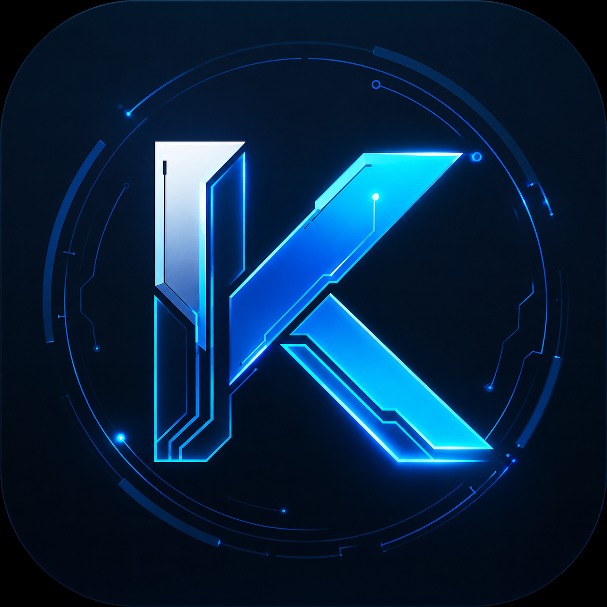

<p align="center">
  
</p>

<h1 align="center">K-Beeline 自动化助手</h1>

<p align="center">
  beeline-ai.com 批量自动化工具<br/>
  多浏览器支持 · AI 智能发帖 · 代理IP池 · 虚拟定位
</p>

<p align="center">
  <a href="https://github.com/zk26/K-beeline/releases/latest"></a>
  
  
  
  <a href="LICENSE"></a>
</p>

---

## 下载

> **[点击下载最新版 KBeelineSetup.exe](https://github.com/zk26/K-beeline/releases/latest)** — 一键安装，双击即运行

## 功能

| 功能 | 说明 |
|------|------|
| 多浏览器 | 支持 Edge / Chrome / Firefox，驱动自动下载更新 |
| 双模式 | 发帖模式（登录→发帖→回写）、激活模式（登录→重置密码→进入芯泉子） |
| AI 发帖 | 接入 OpenAI 兼容 API，自动生成标题与内容 |
| 代理IP池 | 一号一IP，支持主/备代理API + 手动代理列表 |
| 虚拟定位 | 全国城市随机定位，CDP 底层覆盖 + WebRTC 封死 |
| 拟人化 | 随机等待、逐字输入、随机图片裁切 |
| 结果回写 | 状态码、密码、IP、归属地自动写回 Excel 备注列 |
| 账号表模板 | 内置标准模板，自动跳过示例行 |

## 使用

1. 安装后双击桌面「K-Beeline 自动化助手」
2. 选择浏览器（Edge / Chrome / Firefox）
3. 选择运行模式（发帖 / 激活）
4. 导入账号表（支持下载模板）
5. 按需开启功能开关（代理 / 虚拟定位 / AI 发帖）
6. 点击「开始任务」

## 高级设置

| 配置项 | 说明 |
|--------|------|
| 密码策略 | 尝试密码列表、重置密码 |
| 代理池 | 主/备代理 API、手动代理列表 |
| AI 发帖 | API 地址、Key、模型、标题/内容提示词 |
| 性能参数 | 基础等待、显式等待时间 |

## 编译

```bash
git clone git@github.com:zk26/K-beeline.git
cd K-beeline
```

```powershell
# 创建虚拟环境
python -m venv .venv
.\.venv\Scripts\python -m pip install -r requirements.txt -i https://mirrors.aliyun.com/pypi/simple/

# 开发运行
.\.venv\Scripts\python run.py

# 打包 exe
powershell -ExecutionPolicy Bypass -File scripts\build_exe.ps1

# 构建安装程序（需要 Inno Setup 6）
& "C:\Program Files (x86)\Inno Setup 6\ISCC.exe" scripts\installer.iss
```

## 项目结构

```
K-beeline/
├── app/                        # 应用源码
│   ├── main.py                 #   入口（QApplication 初始化）
│   ├── core/                   #   核心业务层（无 UI 依赖）
│   │   ├── browser.py          #     多浏览器驱动构建（反检测/CDP/WebRTC）
│   │   ├── runner.py           #     批量处理引擎（双模式、可停止）
│   │   ├── auth.py             #     登录 / 密码重置 / 强制改密
│   │   ├── posting.py          #     导航 / 发帖 / 真人输入
│   │   ├── config.py           #     配置模型 + JSON 持久化
│   │   ├── proxy_service.py    #     代理池（获取/测试/一号一IP）
│   │   ├── location_service.py #     虚拟定位 + IP/坐标归属地
│   │   └── excel_service.py    #     账号表读写 / 备注构建
│   ├── services/
│   │   └── driver_manager.py   #     多浏览器驱动自动检测/下载/缓存
│   ├── ui/                     #   PySide6 界面层
│   │   ├── main_window.py      #     主窗口
│   │   ├── settings_dialog.py  #     高级设置
│   │   └── worker.py           #     后台线程
│   └── utils/                  #   工具（路径解析、拟人化）
├── assets/                     # 只读资源（图片/模板/驱动/图标）
├── scripts/                    # 构建脚本
├── tests/                      # 测试
├── docs/                       # 文档
└── run.py                      # 启动入口
```

## 运行时数据

用户数据统一存放于 `%LOCALAPPDATA%\KBeeline\`：

| 内容 | 路径 |
|------|------|
| 配置文件 | `config.json` |
| 驱动缓存 | `drivers\{browser}\{version}\` |
| 已用IP记录 | `used_ips.txt` |
| 运行日志 | `logs\kbeeline_YYYYMMDD.log` |

## 兼容性

| 系统 | 浏览器 | 驱动 |
|------|--------|------|
| Windows 10/11 | Edge | msedgedriver（自动下载） |
| Windows 10/11 | Chrome | chromedriver（自动下载） |
| Windows 10/11 | Firefox | geckodriver（自动下载） |

## 注意

1. 首次运行如被 Windows Defender 拦截，选择「仍要运行」
2. AI 发帖功能需在【高级设置】中配置 API 地址、Key 和模型
3. 代理API密钥为随软件分发的付费资产，请勿公开仓库提交

## License

[MIT](LICENSE)

---

<p align="center">
  Powered by <a href="https://www.ikee002.top">小可</a> · www.ikee002.top
</p>
